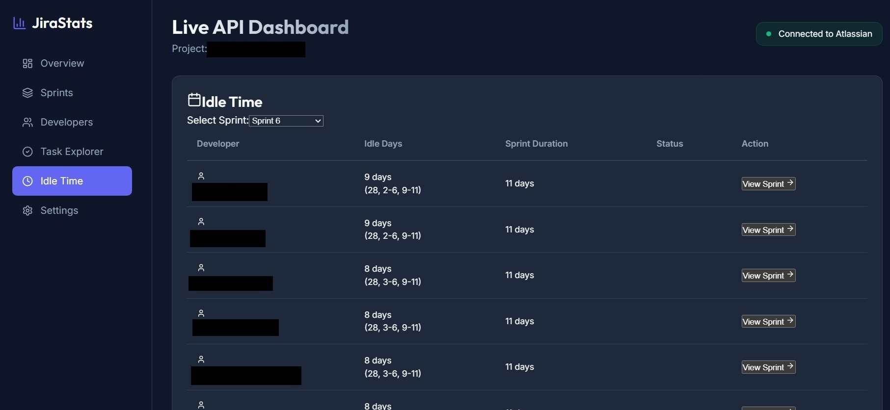
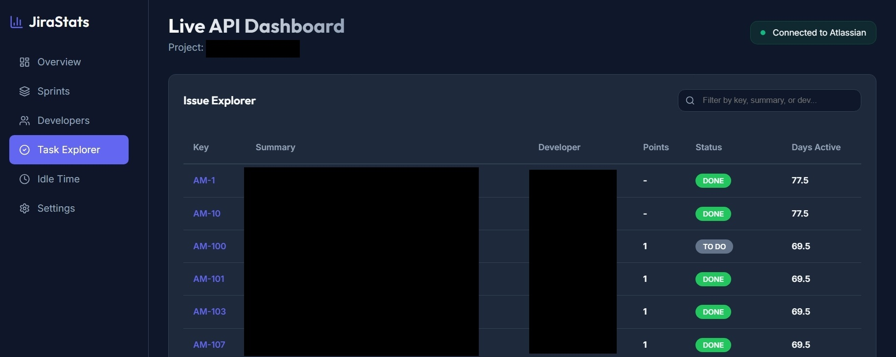
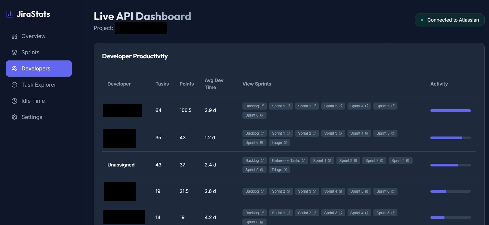
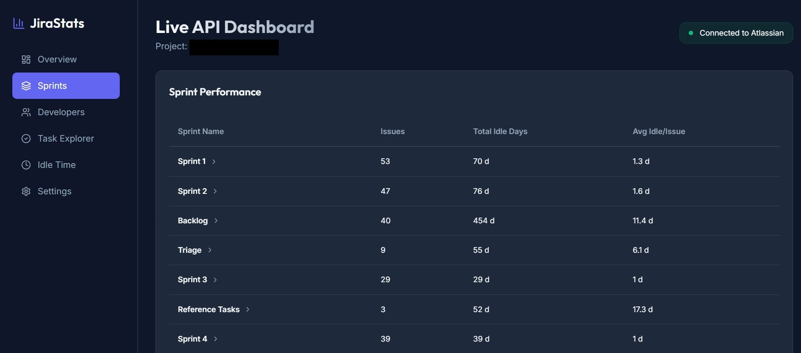
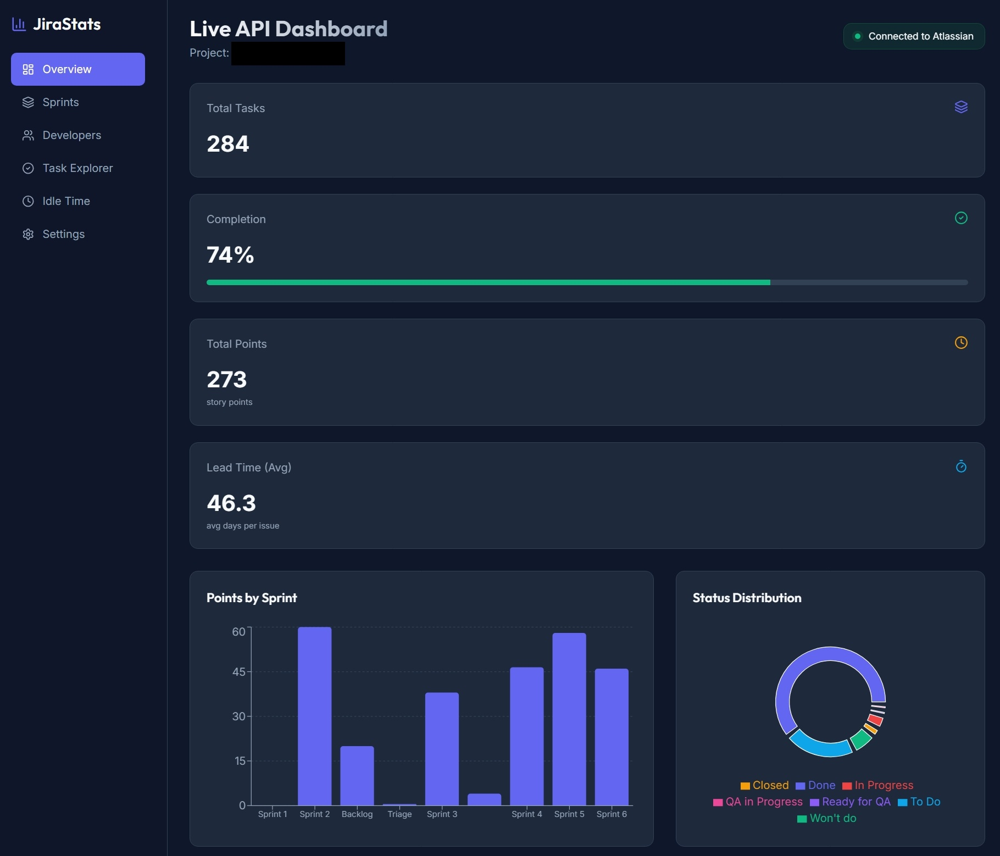
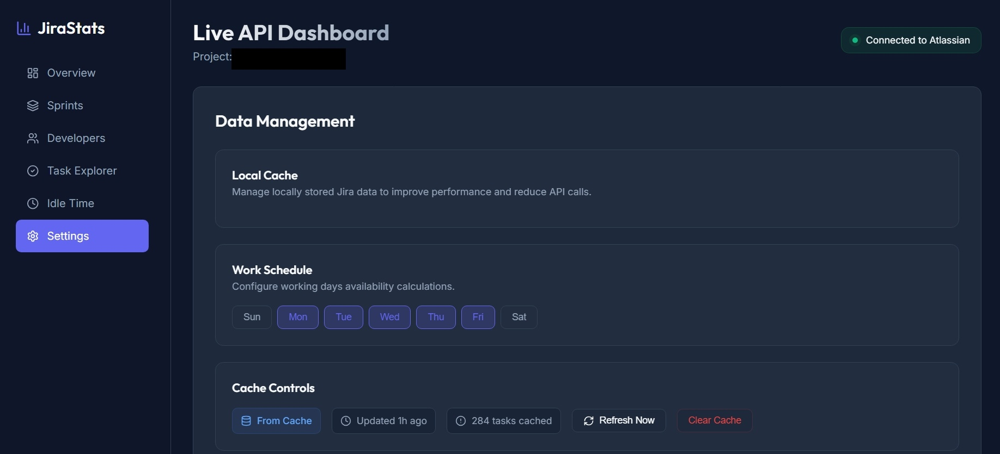
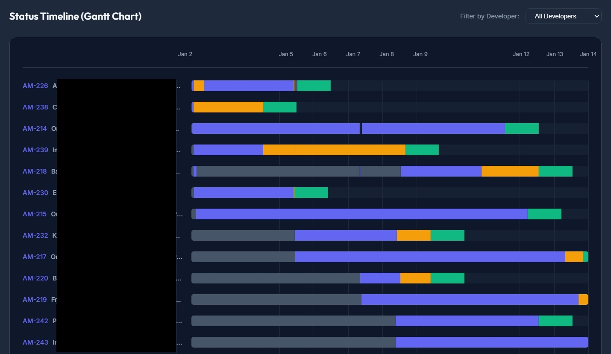

# Jira Dashboard

A modern, high-performance dashboard for visualizing Jira data, built with React, TypeScript, and Vite.

## Features

- **Overview**: High-level metrics including total tasks, completion rates, and cumulative effort.
- **Sprint View**: Detailed breakdown of the current sprint's progress and velocity.
- **Developer Table**: Performance metrics for individual developers, including total time spent and average task duration.
- **Gantt Chart**: Visual timeline of issues and their dependencies.
- **Issue Explorer**: Advanced filtering and searching of Jira issues with direct links to Jira.
- **Idle Time View**: Identify bottlenecks and waiting periods in your workflow.
- **Overtime View**: Track and analyze developer workload and potential burnout.
- **Settings**: Configure Jira API credentials and dashboard preferences.
- **Cache Management**: Local storage caching for improved performance and offline access.

## Screenshots

|                                                                        |                                                                        |
| ---------------------------------------------------------------------- | ---------------------------------------------------------------------- |
|  |  |
|  |  |
|  |   |
|    |                                                                        |

## Tech Stack

- **Frontend**: React 19, TypeScript, Vite
- **Styling**: Tailwind CSS
- **Icons**: Lucide React
- **Data Fetching**: Custom hooks with Jira REST API and CSV support
- **State Management**: React Context and Hooks
- **Charts**: Recharts / Custom SVG components

## Getting Started

### Prerequisites

- Node.js (v18 or higher)
- Yarn (preferred)
- Jira API Token and Instance URL (optional if using CSV)

### Installation

1. Clone the repository:

   ```bash
   git clone https://github.com/your-username/jira-dashboard.git
   cd jira-dashboard
   ```

2. Install dependencies:

   ```bash
   yarn install
   ```

3. Create a `.env` file in the root directory and add your Jira credentials (see `.env.example`):
   ```env
   VITE_JIRA_URL=https://your-instance.atlassian.net
   VITE_JIRA_EMAIL=your-email@example.com
   VITE_JIRA_TOKEN=your-api-token
   ```

#### How to get a Jira API Token

1. Log in to your Atlassian account at [id.atlassian.com](https://id.atlassian.com).
2. Go to **Security** > **API tokens**.
3. Click **Create API token**.
4. Give your token a label (e.g., "Jira Dashboard") and click **Create**.
5. Copy the token immediately and save it securely (you won't be able to see it again).

### Data Update (CSV Method)

If you are using the Jira Data Extractor tool:

1. Generate a new CSV using your extractor.
2. Copy the resulting `.csv` file to `public/data.csv`.
3. The dashboard will automatically reflect the new data on the next reload.

### Development

Start the development server:

```bash
yarn dev
```

The dashboard will be available at `http://localhost:5173`.

### Building for Production

```bash
yarn build
```

The production-ready files will be in the `dist` directory.

## License

MIT
